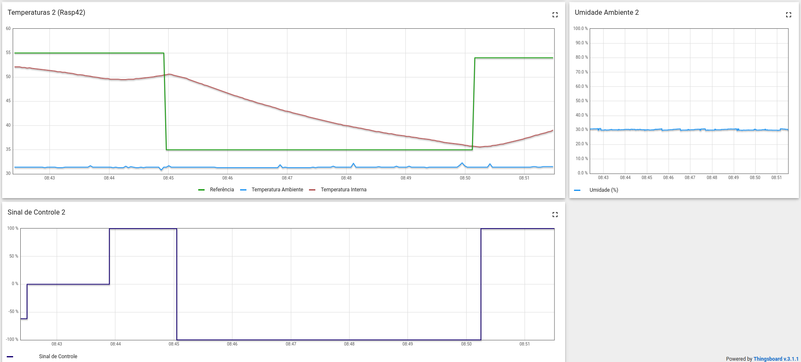
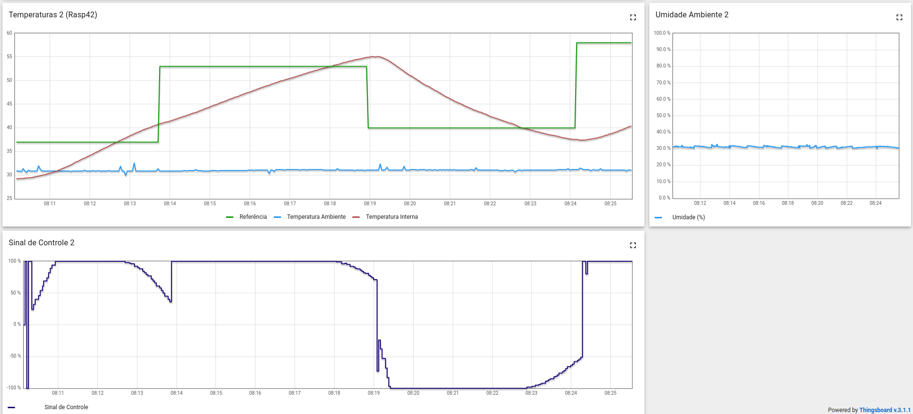

## Projeto 1 - FSE

### 1) Aluno:

- **Nome:** Guilherme Mendes Pereira
- **Matricula:** 17/0129411

### 2) Introdução

Esse projeto tem como finalidade a implementação é uma solução em C para o controle de um sistema contendo sensores, um resistor, uma ventoinha e um display LED por meio de uma RaspberryPi.

### 3) Instruções para executar

```
$ make

$ make run
```

### 4) Dados coletados

- O sistema faz uso de ontrole de temperatura, sendo um o PID e outro o On-Off gerando um arquivo CSV a partir da sua execução para coleta de dados como: Localtime, Temperatura Interna, Temperatura Externa e Temperatura de referência.

- **ON_OFF**



- **PID**



### 6) Referências

[Controle do LCD](http://www.bristolwatch.com/rpi/i2clcd.htm)  
[WiringPi GPIO](http://wiringpi.com)  
[PWM via WiringPi](https://www.electronicwings.com/raspberry-pi/raspberry-pi-pwm-generation-using-python-and-c)
[PID - Wikipedia](https://pt.wikipedia.org/wiki/Controlador_proporcional_integral_derivativo)  
[Driver da Bosh para o sensor BME280](https://github.com/BoschSensortec/BME280_driver)  
[BCM2835 - GPIO](http://www.airspayce.com/mikem/bcm2835/)  